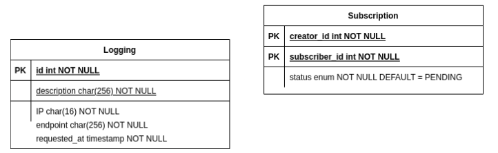

# Binotify SOAP Service

## Deskripsi web service
Service yang bisa menangani permintaan subscription di Binotify App. Service ini dibangun dengan JAX-WS

## Skema basis data yang digunakan

## Penjelasan mengenai pembagian tugas masing-masing anggota

-  Security: 13520103
-  Database: 13520103
-  Menerima Permintaan Subscription dari Binotify App: 13520103, 13520018
-  Menerima Penerimaan / Penolakan Permintaan Subscription: 13520103, 13520018
-  Endpoint Check Status Permintaan: 13520103
